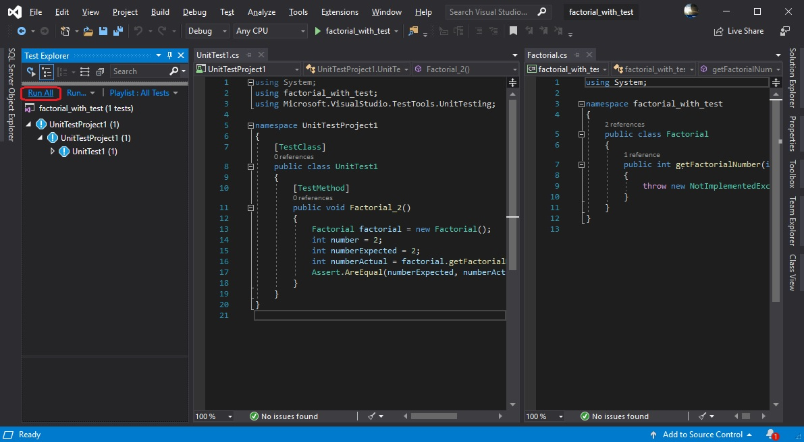

#de Software

---

E aí devs! Tudo compilando/buildando, ops, tudo certo?!?

Queria fazer um teste aqui: **quem faz testes?** (meio redundante né kkkkk).

Bom, de um bom tempo para cá, sabemos que uma das melhores formas de documentarmos nosso código, é através dos testes (seja unitário, de integração, A/B, performance, enfim), pois depois nem nós mesmo saberemos o que ‘aquilo’ está fazendo e se está fazendo da forma correta.

Quem já ouviu dizer ou até mesmo já disse: *‘Se está funcionando, não mexa!’*, *“Mas é preciso implementar esta funcionalidade ...”*, aí é que os problemas começam a dar problemas (outra redundância rsrsrs).

####Se isto pode acontecer com testes, imagine sem eles!?!

Esta cultura de fazer testes, nem sempre é bem vista por alguns de nós programadores e/ou lideres, mas com toda certeza, o hábito de fazer ou não teste, pode determinar muito na vida útil e manutenibilidade do código.

####Bom, vamos colocar a mão na massa, ops, no código?!?

Para isto, iremos utilizar a linguagem [C#](https://docs.microsoft.com/pt-br/dotnet/csharp/), no [Visual Studio 2019](https://visualstudio.microsoft.com/pt-br/?rr=https%3A%2F%2Fwww.google.com%2F) (lembrando que o conceito se aplica a qualquer linguagem de mesmo paradigma).

Abra o Visual Studio e escolha *“Create a new project”* para criarmos um novo projeto (que na verdade mesmo, será uma solução pois teremos dois projetos nela – pequeno spoiler).

Vamos agora, escolher o projeto principal, o qual será testado. Neste caso, vamos escolher *“Class Library”*, mas poderia ser qualquer outro tipo de projeto.

Dê um nome ao projeto, escolha um diretório (se preferir pode mudar o nome da solução), em seguida, clique em *“Create”*.

Esta é a tela inicial do projeto. Logo ao lado direito, temos a guia *“Solution Explorer”*, aonde temos a solução e o projeto que acabamos de criar.

Por práticas de boas maneiras, vamos renomear o arquivo da classe principal do projeto.

Clique uma vez com o botão direito do mouse e depois escolha a opção *"Rename"*.

Renomeie para Factorial.

Vamos fazer a mesma coisa para o nome da classe, renomeando também para Factorial.

Após renomearmos os itens acima, ficará assim:

Bom, neste momento, temos uma solução e nela um projeto, agora temos que ter um outro projeto, que será destinado para os nossos testes. Para isto, clique uma vez com o botão direito do mouse na descrição da solução, depois vá até *“Add”*, em seguida, clique em *“New Project”*

Nesta tela, altere a opção *Project Type* para *Test* (assim filtrando os tipos de projetos de teste).

Para este handson, escolheremos *“Unit Teste Project”*.

Escolha este tipo de teste e em seguida clique no botão *“Next”*

Se quiser, pode mudar o nome do projeto de testes (neste caso eu preferi não mudar, mas isto fica a seu critério). Clique no botão *“Create”*.

Agora temos uma solução e nela dois projetos (um que é o projeto principal e o outro que é um projeto para testar este principal).

Classe do projeto de teste.

Seguindo as práticas de boas maneiras, iremos refatorar o nome deste método para Factorial_2 (método que será destinado a testarmos o fatorial do número dois).

NOTA: um detalhe muito importante, que faz parte da documentação, é nomear assinaturas de métodos e variáveis/contantes com nomes que façam sentido (sem a necessidade de comentários).

**Vamos fazer tudo passo a passo, vulgo Baby Step.**

Partindo do pressuposto que todos nós sabemos (ou temos uma lembrança do que são fatoriais. Aqui, um link https://pt.wikipedia.org/wiki/Fatorial que utilizei par refrescar minha memória), iremos implementar o corpo do método que fará o teste para testarmos o fatorial do número 2.

Este código representa uma maneira de fazermos este teste.

####Explicação linha a linha:

**Linha 12** – estamos instanciando um objeto do tipo Factorial (nossa classe do projeto principal);

**Linha 13** – representa o número ao qual queremos saber o correspondente fatorial;

**Linha 14** – o número fatorial esperado (o resultado esperado);

**Linha 15** – o número que receberá o resultado do método da classe principal que faz este cálculo;

**Linha 16** – uma das linhas principais deste método de teste, esta linha compara os valores esperados e atuais/encontrados.

Note que a *linha 12* está em vermelho, pois esta classe de teste ainda não reconhece o tipo Factorial (que está em outro projeto). Para sanarmos este acontecimento, posicione o cursor (clique na linha 12 – linha cuja qual estamos instanciando um objeto do tipo Factorial), note que logo no começo desta linha, aparece um símbolo de uma lâmpada amarela (sugestão que a própria IDE lhe sugere), clique na setinha para baixa, logo ao lado, e escolha a opção *“Add reference to...”*.

Isto faz com que este projeto reconheça a classe do outro projeto (existem outras formas de fazer isto, como adicionar referências ao projeto de teste, enfim, pode fazer da maneira que achar melhor, o importante é que este projeto de testes possa reconhecer o outro projeto).

Bom, resolvemos a questão da instância da classe, no entanto, podemos notar que na linha 16 aparece um erro. Isto se dá pelo fato de que este método ainda não existe na classe principal.

Podemos de diversas maneiras solucionar isto. Iremos adotar uma estratégia semelhante a que usamos para resolver a instância da classe, iremos usar a IDE para nos auxiliar.

Posicione o cursor na **linha 16** (linha do erro), clique na lâmpada amarela que aparece logo no começo desta linha e depois clique na opção *“Generate method....”* ...

... isto irá gerar uma assinatura para este método, na classe principal.

Bom, agora podemos começar a brincar, ops, executar nosso teste. Para isto, clique no menu *“Test”*, depois em *“Windows”* e por fim, em *“Test Explorer”*.

Assim será possível vermos a aba de teste e respectivos resultados.

Agora sim, chegou a hora chave deste tutorial: vamos começar a executar os teste eheheheh!

Clique no link *‘Run All’*.

Eita, mas falhou tudo (na verdade temos apenas um teste, ainda).

Lembrando novamente, estamos fazendo tudo passo a passo para realmente entendermos a coisa toda.

Temos que implementar o corpo do método **getFactorialNumber** de nossa class Factorial, vamos lá.

Vamos clicar novamente no link *“Run All”* (vamos torcer para que desta vez dê certo).

Agora sim, deu certo (eu sabia iria dar certo ehehehe).

Sei que alguns de você, até mesmo eu, temos sérias dúvidas sobre esta implementação *‘duvidosa’* que fiz no método **getFactorialNumer**, mas acalmemo-nos, pois estamos no Baby Step.

Vamos continuar......agora, vamos fazer a implementação de um segundo teste, vamos fazer um teste para o fatorial correspondente ao número 3.

Fiz praticamente um copy-paste, mudando os valores de algumas variáveis (linhas 20 até 28).

Bora executar novamente todos os testes.

Interessante, agora temos dois testes. O primeiro passou *“dboa”*, o segundo não passou!

Isto ocorre pela forma que implementamos o método **getFactorialNumero**, pois estamos até então, retornando um código fixo (hardcoded, coisa feia né? Mas confesse aí, tu já fez isto!).

Vamos refatorar nossa implementação e deixa-la um pouco mais elegante e funcional.....apelei, vamos colocar ela recursiva. #RruuhhHH!!

Pronto, refatoramos nosso código e ainda o deixamos recursivo (tomara que não precise de manutenção kkkkk).

Bora novamente executar todos os testes.

Agora sim, passamos em todos os testes (somos phodas né?!?)

Galera, este foi apenas um pequeno exemplo de como que podemos aplicar testes em nossos códigos.

###Lembrem-se:
* cada teste construído, deve, obrigatoriamente, falhar e por fim, ser aprovado;
* ao refatorar ou implementar nova funcionalidade, é imprescindível executar novamente todos os testes novamente, assim é garantido que tais modificações não quebraram nenhuma parte do todo.

Testes são de extrema importância e relevância, pois asseguram a visibilidade de possíveis inconsistências em nosso código ao decorrer de refatorações, que são feitas e muito mais benefícios que só os testes proporcionam, além é claro, da documentação sempre atualizada.

Testes são ótimos, mas use-os com moderação e discernimento.

Até a próxima!

---

Link do GitHub deste projeto ( https://github.com/kaichiro/factorial_with_test-tdd )

---

Contruí este artigo com base no artigo publicado pelo [Fabricio Leonard](https://github.com/fabricioLeonard) em [developeracademy.com.br](https://developeracademy.com.br/metodologias-ageis/praticando-tdd-com-visual-studio-2019/).